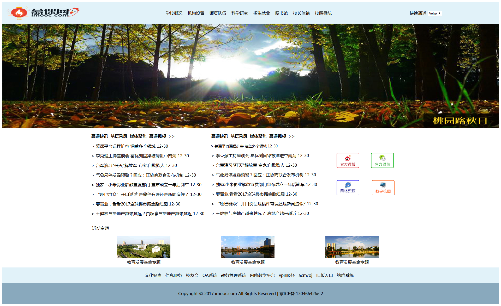

### 3-10 作业

小伙伴们，我们学习了html来搭建网页的内容，接下来让我们去实现效果图中所展示的网页吧！（上传作业时，记得也要将图片文件夹放进去一起打包上传）

效果图如下：

##### 任务描述
###### 一、语言和环境
1. 实现语言:HTML
1. 环境要求及开发工具:建议 Sublime text

###### 二、网页整体要求：
1. 要求页面整洁、美观，与提供的页面效果图、结构基本保持一致；
1. 要求HTML代码书写、命名符合规范，在代码中添加必要的注释。
1. 网页文件夹管理，图片文件要独立建文件夹

###### 三、具体要求：  
1. 网页分为以下几部分：顶部、banner图、新闻区、近期专题区、友情链接区、页脚区，网页内容居中显示。
1. Banner图展示块：宽度100%占据整个浏览器。
1. 网页结构布局使用HTML标签中的表格标签（<table></table>）
1. 页面中涉及到的颜色

##### 评分标准是什么？
规范【4分】
- 网页文件夹管理，图片资料独立文件夹。
- HTML代码规范及添加适量注释。

网页整体【10分】
- 页面整体结构使用表格进行布局，网页居中显示，每个区域背景宽度为100%。

顶部【20分】
- 与效果图结构基本保持一致：导航、Logo区 、下拉列表区  。

banner图【10分】        
- 与效果图结构基本保持一致；
- Banner图片宽度和浏览器的宽度等宽。

新闻区【30分】
- 与效果图结构基本保持一致；
- 添加相应图片与文字，每项内容之间有一定距离以及颜色和字体大小设置。

近期专题区【10分】
- 与效果图结构基本保持一致；由图片和文字组成。

友情链接区【8分】
- 与效果图结构基本保持一致；
- 内容整体居中显示。

页脚区【8分】
- 网页版权信息，文本内容垂直水平居中显示。
